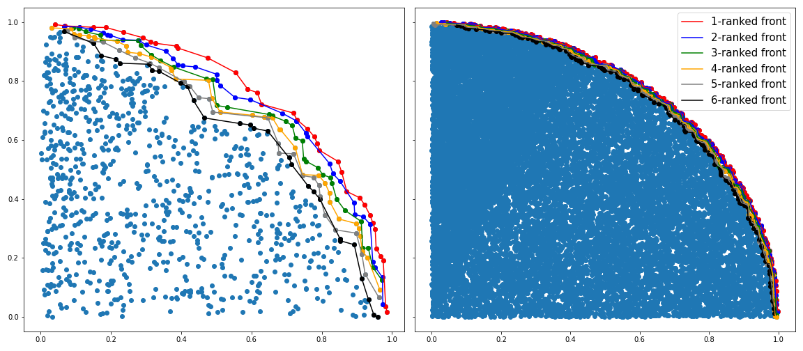

>Notice: This is research code that will not necessarily be maintained in the future.
>The code is under development so make sure you are using the most recent version.
>We welcome bug reports and PRs but make no guarantees about fixes or responses.

DESCRIPTION
==================================================
```pareto_front``` project is a GPU-accelerated code for muli-dimensional Pareto optimization.           


INSTALL
=======

```
git clone git@github.com:pgniewko/pareto_front.git
pip install ./pareto_front --user
```

USAGE
=====

```python
import numpy as np
import matplotlib.pyplot as plt
import torch

from pareto_front import gpu_pareto_front

N = 2000
x_small = np.random.rand(N,2)
x_small[:,1] *= 2
x_small[:,0], x_small[:,1] = (abs(np.sqrt(x_small[:,0]) * np.cos(x_small[:,1])), 
                              abs(np.sqrt(x_small[:,0]) * np.sin(x_small[:,1])))

N = 20000
x_large = np.random.rand(N,2)
x_large[:,1] *= 2
x_large[:,0], x_large[:,1] = (abs(np.sqrt(x_large[:,0]) * np.cos(x_large[:,1])), 
                        abs(np.sqrt(x_large[:,0]) * np.sin(x_large[:,1])))

dev = torch.device(cuda)
x_t_small = torch.tensor(x_small).to(dev)
x_t_large = torch.tensor(x_large).to(dev)
fronts_small = gpu_pareto_front(x_t_small)
fronts_large = gpu_pareto_front(x_t_large, fronts_number=6)

fig, (ax1, ax2) = plt.subplots(1,2, sharey=True, figsize=(16, 7))

ax1.scatter(x_small[:,0], x_small[:,1])
ax2.scatter(x_large[:,0], x_large[:,1])

colors = ['red', 'blue', 'green','orange', 'grey', 'black']

for (ax, fronts, x) in zip((ax1, ax2), [fronts_small, fronts_large], [x_small, x_large]):
    for (i,color) in enumerate(colors):
        fronts_i = fronts[i].cpu()
        d = np.array(x[np.array(fronts_i),:])
        ax.scatter(d[:,0], d[:,1], c=color)
    
        zipped_lists = zip(d[:,0], d[:,1])
        sorted_pairs = sorted(zipped_lists)

        tuples = zip(*sorted_pairs)
        x_sorted, y_sorted = [list(tuple) for tuple in zip(*sorted_pairs)]
        ax.plot(x_sorted, y_sorted, c=color,label=f'{i+1}-ranked front')
plt.legend(fontsize=15)
plt.tight_layout()
```



LICENSE
=======
The library is open-source. 

COPYRIGHT NOTICE
================
Copyright (C) 2022-, Pawel Gniewek
Email: gniewko.pablo@gmail.com
All rights reserved.
License: MIT
